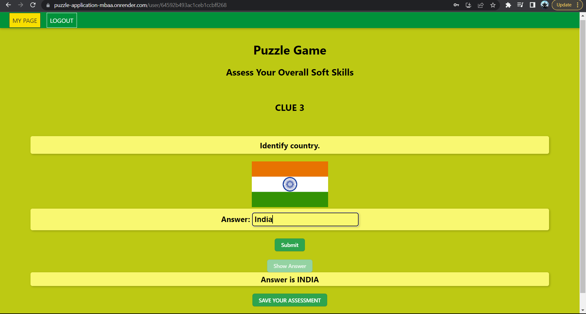

# PUZZLE APPLICATION 

This application is a fun game which assess soft skills of our user and display the score at the end of play. 

For the user logging in first time, credential used will be saved and can be used again to login.

Admin can see the dashboard which shows the analytics of every user.


## Solution

The hunt will get completed once all the given 5 clue are answered correctly.

If user doesn't know the answer then it can use the 'Show Answer'
funcitonality to complete the hunt.
## Features

- Anyone with email id and password can play game.
- It contains 5 clues and minimum 1 solution.
- Clues can be used to move forward in game.
- Analytics is stored in database.
- If user logs out before completing game, then user will start from the same step rather than from clue 1.

### Additional Features
- User analytics dashboard can bee seen by admin.


## Soft Skill
This app can assess soft skill using three categories: 

1.  Math
2.  Geography
3.  Sport

- Math can be used to assess soft skills such as problem-solving, critical thinking, and decision-making. 

- Geography can be used to assess soft skills such as cultural awareness and communication.

- Sports can be used to assess soft skills such as teamwork, leadership, and perseverance.


## Screenshots

### Users





### Admin


## How to Setup

Clone the frontend and backend repository

```bash
  git clone https://link-to-project
```

Go to the project directory

```bash
  cd my-project
```

Install dependencies

```bash
  npm install
```
For environment variables

```bash
  create .env file
```

Start the server

```bash
  npm run start
```


## Environment Variables

To run this project, you will need to add the following environment variables to your .env file

FRONTEND

`REACT_APP_BACKEND_URL`

BACKEND

`DB_USER`
`DB_PASSWORD`
`DB_NAME`

